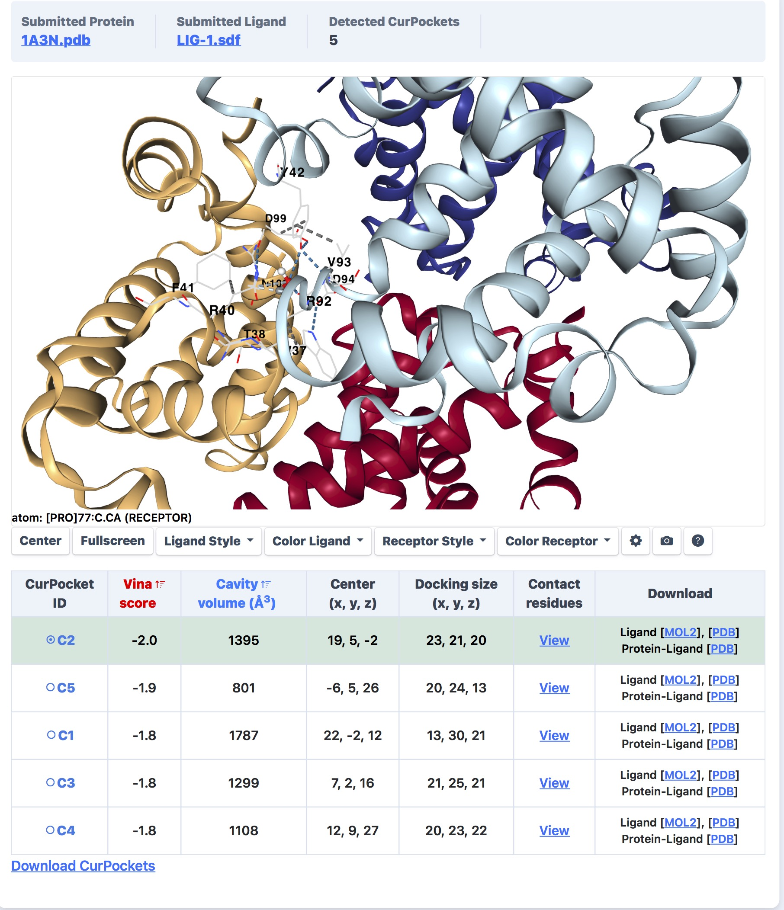

# Protein–Ligand Docking Analysis

## 📌 Overview
This project explores a basic protein–ligand docking workflow to investigate potential interactions between hemoglobin and carbon monoxide (CO) using computational docking tools.

## 🔬 Method
- Used a molecular docking web server
- Uploaded the hemoglobin protein structure in PDB format
- Used carbon monoxide (CO) as the ligand
- Predicted potential binding pockets and interaction sites
- Evaluated docking scores and interacting residues

## 📊 Key Findings
- Several potential binding pockets were identified within the hemoglobin structure
- The best predicted interaction produced a docking score of approximately −2.0
- Multiple amino acid residues surrounding the predicted binding region were detected
- The docking visualization suggested possible ligand positioning within the protein structure

## 🧠 Biological Interpretation
This analysis demonstrates how molecular docking can be used to computationally explore protein–ligand interactions. The results provide insight into how small molecules such as carbon monoxide may interact with hemoglobin at specific binding regions.

Although simplified and exploratory, this workflow introduces key concepts commonly used in structural bioinformatics and drug discovery research.

## 🛠 Skills Demonstrated
- Protein–ligand docking
- Structural bioinformatics
- Binding pocket analysis
- Interpretation of docking scores
- Working with PDB structures
- Molecular interaction visualization

## 📁 Project Files
- PDF report with detailed explanation
- Docking visualization screenshots

## 📸 Docking Visualization

